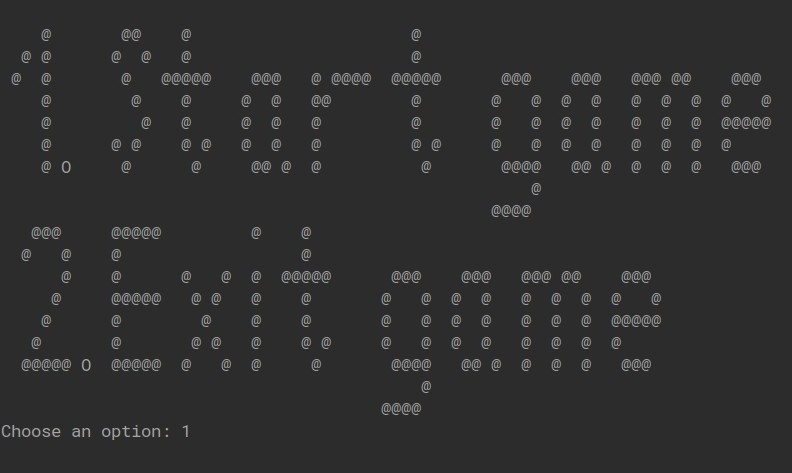
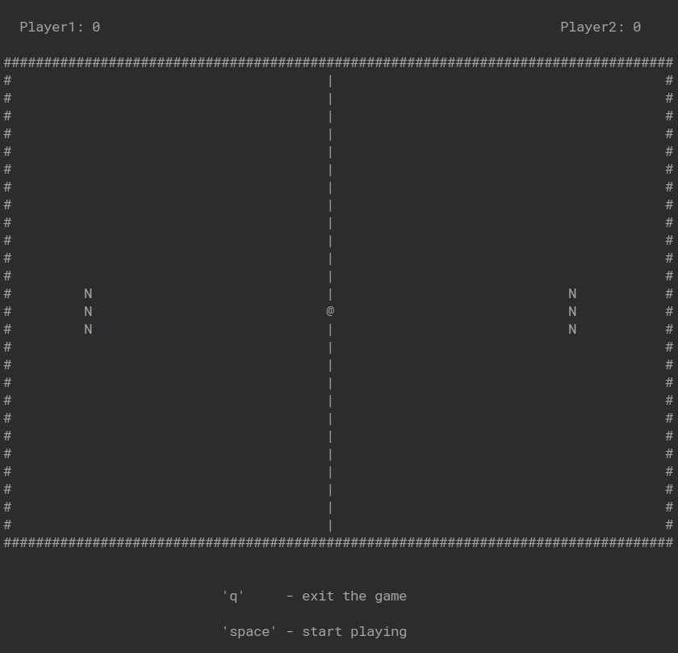

# UNIX Ping-Pong
Ping-pong console game written in C. 
Available platforms: Linux, MacOS.

# Control Keys
### Player 1: A / a - UP, Z / z - DOWN. 
### Player 2: K / k - UP, M / m - DOWN. 

# Gameplay

